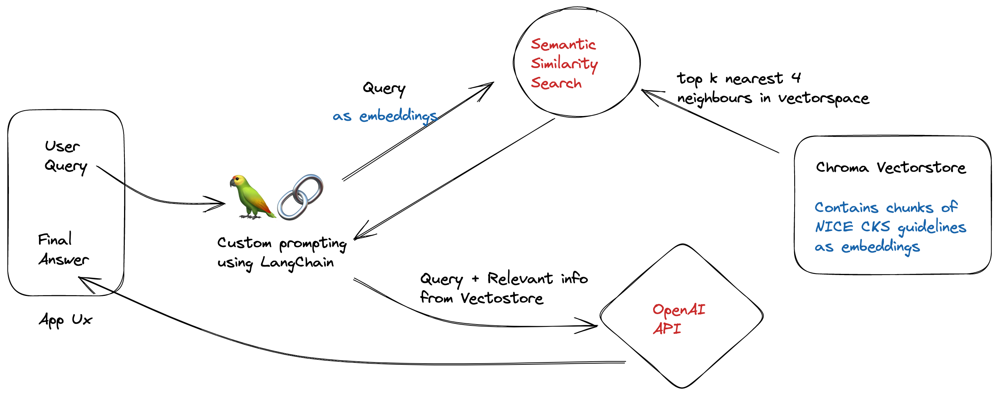

# 🦜️🔗 Ask NICE

Ask any medical question and get a beautiful explanation with the [NICE Clinical Knowledge Summaries](https://cks.nice.org.uk/) as the source. You can even clear your PLAB or MRCP MCQ doubts.

## Disclaimer
DO NOT use as a substitute for professional medical advice. This is a work in progress meant for **EDUCATIONAL PURPOSES ONLY**.
## Demo

Try out the app [here](https://asknice.streamlit.app)


## Deployment

To deploy this project locally, ensure that python 3.10 is installed run

```bash
  git clone https://github.com/faz-cxr/nice.gist
```

```bash
  pip install -r requirements.txt
```
```bash
  streamlit run Home.py
```
## 📚 Technical description

Question-Answering has the following steps, all handled by [RetrievalQAWithSourcesChain](https://python.langchain.com/en/latest/modules/chains/index_examples/vector_db_qa_with_sources.html):

1. Given a user question, look up relevant documents from the vectorstore using Embeddings and similarity search.
2. Determine what a standalone question would be (using GPT-3.5-turbo).
3. Pass the standalone question and relevant documents to GPT-3.5-turbo to generate a final answer.


