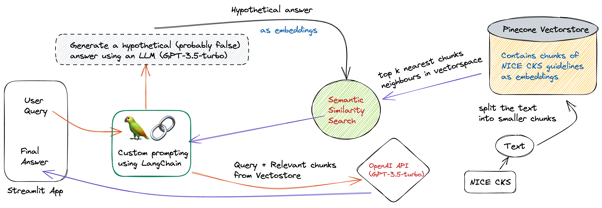

# 📚🔍 Chat with NICE

Looking for medical answers? Ask NICE! Get a beautiful explanation with the [NICE Clinical Knowledge Summaries](https://cks.nice.org.uk/) as the source. You can even clear your PLAB or MRCP MCQ doubts. Feel free to ask followup questions.

## 🚫 Disclaimer

DO NOT use as a substitute for professional medical advice. This is a work in progress meant for **EDUCATIONAL PURPOSES ONLY**.

## 💬 Demo

Try out the app. Give it a go! ->  [ChatNICE](https://chatnice.streamlit.app)
You can also try the simpler question-answering app [here](https://asknice.streamlit.app).

## 🚀 Deployment

To deploy this project locally, ensure that python 3.10 is installed and then follow these steps:

```bash
  git clone https://github.com/faz-cxr/nice/tree/Chat-UI.gist
```

```bash
  pip install -r requirements.txt
```
```bash
  streamlit run Home.py
```
## 📝 Technical description

The app implements the following academic papers:

- [In-Context Retrieval-Augmented Language Models](https://arxiv.org/abs/2302.00083) aka **RALM**
  - When you give Ask NICE a question, it first retrieves relevant documents (in this case, [NICE Clinical Knowledge Summaries](https://cks.nice.org.uk/)). It then passes those documents, along with the original question, to the language model to generate a response.
- [Precise Zero-Shot Dense Retrieval without Relevance Labels](https://arxiv.org/abs/2212.10496) aka **HyDE** (Hypothetical Document Embeddings)
  - HyDE is an embedding technique that takes queries, generates a hypothetical answer, and then embeds that generated answer to fetch documents more accurately.

Question-Answering has the following steps, all handled by [Question Answering with Sources Chain](https://python.langchain.com/en/latest/modules/chains/index_examples/qa_with_sources.html):

1. Given a user question, create a hypothetical answer (possibly false, with factual inaccuracies) and then store that as Embeddings.
2. Look up relevant documents from the vectorstore using Embeddings and a similarity search.
3. Pass the user question and relevant documents to GPT-3.5-turbo to generate a final answer.

Here's a visual representation of how it all works:

